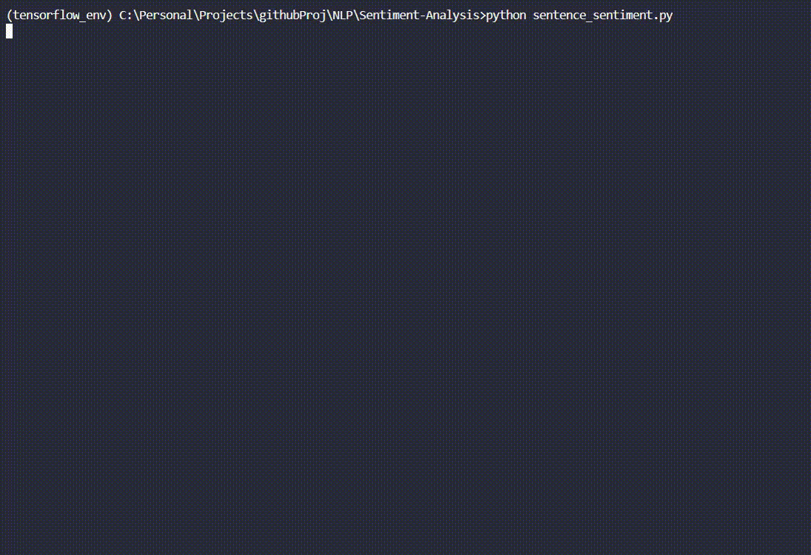

# Twitter Sentiment Analysis
## Basic Idea
In this project, the goal is to create and train a neural network to learn sentiment of Twitter text. 

Sentiment Analysis is pretty interesting as it's a pretty efficient way to understand the public's opinion on certain topic or understanding customer's feedback on certain product without human bias.

## Implementation
The entire process of cleaning/processing Twitter data to training & testing the neural network could be found in the ```testing.ipynb``` file.

For the convenience of other's if they want to try this out I've clean the code into Python scripts. All the data processing code could be found within the ```process_data.py``` file. The entire script is actually "chained" meaning that the user could simply run the following code in Python:
```
import process_data as data
attr, test, train = data.formatted_data()
```
The script will then automaticaly call all the necessary function itself to clean/process the data, and outputs the resulting data to the user.

Or the user could just simply import the ```train_model.py``` file, which is in charge of creating and training the model, as this script will automatically call ```process_data.py``` and get the cleaned data itself.

The current model used for training is a Long Short-Term Memory (LSTM) Recurrent Neural Network built using Tensorflow with Keras and GloVe as weights for the Embedding Layer.

If the User wishes to modified the architecture of the model, they could simply tweak the ```_create_model()``` function within ```train_model.py```.
This script is also "chained", if the User is fine with the current architecture or have already the changed the architecture, they could simply run the following code:
```
import train_model as tm
model = tm.train()
```
And the script will create the model and train it for the user.

There's a couple parameters the user could play, including saving files and changing data size.

When I was training the neural network, due to the lack of computational power I only used half the dataset for training (which is also the default setting for ```train_model.py```). The result of the model architecture and hyperparameter I chose are shown below. The model also achieved 75.58% accuracy when used on test data, which is shown within ```testing.ipynb```. The results are not too bad, but probably could be improved upon with a better or more complex architecture (keep in mind this will also increase the computational cost).

 

## Demo

